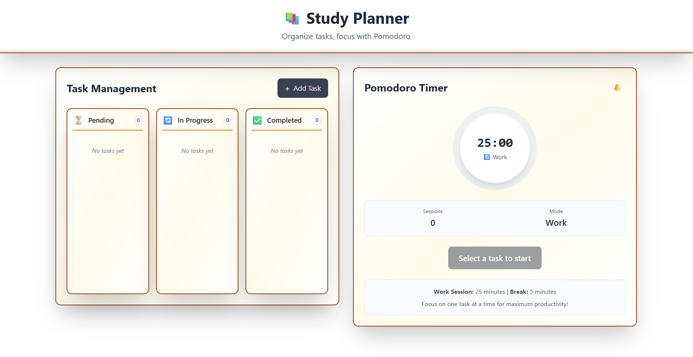

# 📚 Study Planner

A modern, visually appealing productivity app to help you organize your study tasks and stay focused using the Pomodoro technique.  
Built with React and Tailwind CSS, featuring a beautiful 3D card interface and a clean, minimalist color theme.

---

## ✨ Features

- **Task Management:**  
  Add, edit, delete, and organize your study tasks in a Kanban-style board (Pending, In Progress, Completed).

- **Pomodoro Timer:**  
  Focus on one task at a time with a built-in Pomodoro timer (25/5 minute cycles), including session tracking and notifications.

- **3D Card UI:**  
  Every box and card features a 3D effect with smooth shadows, gradients, and interactive hover animations.

- **Persistent Storage:**  
  Your tasks and timer state are saved in your browser (localStorage), so you never lose your progress.

- **Responsive Design:**  
  Works beautifully on desktop and mobile devices.

---

## 🖥️ Tech Stack

- **Frontend:** React
- **Styling:** Tailwind CSS (with custom gradients and shadows)
- **State Management:** React Hooks
- **Build Tool:** Vite

---

## 🚀 Getting Started

1. **Clone the repository:**
   ```bash
   git clone https://github.com/your-username/studyplanner.git
   cd studyplanner
   ```

2. **Install dependencies:**
   ```bash
   npm install
   ```

3. **Start the development server:**
   ```bash
   npm run dev
   ```

4. **Open in your browser:**  
   Visit [http://localhost:5173](http://localhost:5173)

---

## 📸 Screenshots



---

## 🛠️ Customization

- **Theme:**  
  Easily adjust colors and shadows in the Tailwind config or component files to match your style.

- **Pomodoro Settings:**  
  Change work/break durations in `PomodoroTimer.jsx` if you want custom intervals.

---

## 🙏 Credits

- [React](https://reactjs.org/)
- [Tailwind CSS](https://tailwindcss.com/)
- Pomodoro technique inspiration
